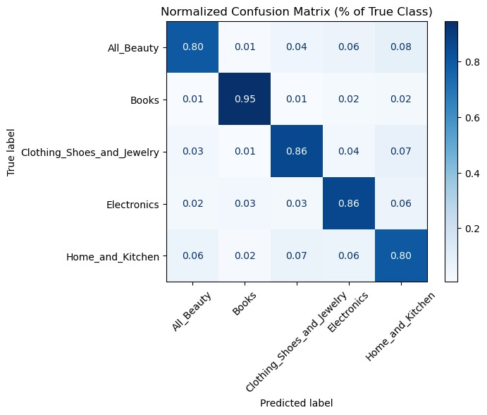
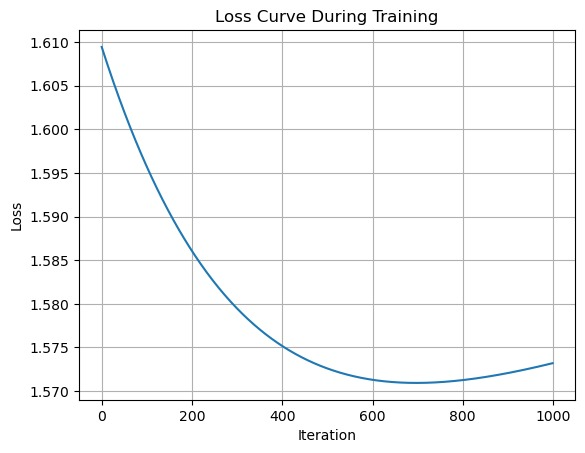
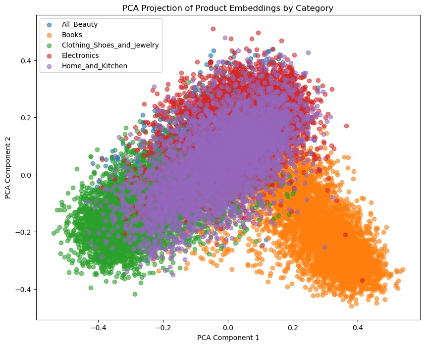

# Retail Intelligence System: NLP & Machine Learning on Customer Reviews

## Overview
This project builds an end-to-end machine learning system for RetailTech to extract insights from customer reviews. It combines natural language processing, classification, regression, and anomaly detection to support multiple business functions.

---

## Business Objectives
RetailTech aims to:

- Automatically classify products into categories  
- Predict customer ratings from review text  
- Detect potentially fake or suspicious reviews  
- Reduce manual review effort  
- Improve recommendation quality and revenue  

---

## System Architecture

### 1. Product Classification
- Transformer embeddings (MiniLM)
- Models: Logistic Regression, Random Forest, KNN
- Ensemble approach achieves **~85% accuracy**



---

### 2. Rating Prediction
- Regression + classification approaches
- Feature engineering:
  - Sentiment scores
  - Review length
  - Helpfulness votes
- Improved prediction vs raw embeddings baseline

---

### 3. Fake Review Detection
- Anomaly detection techniques
- Identifies suspicious or inconsistent reviews
- Supports Trust & Safety team

---

### 4. Logistic Regression from Scratch
- Custom implementation using NumPy
- Supports:
  - Binary + multi-class (OvR / Softmax)
  - L1 / L2 regularization
- Compared with sklearn:
  - Custom: ~64% accuracy
  
  - sklearn: ~85% accuracy  

---

### 5. Business Impact
- Estimated **172% ROI over 3 years**
- Breakeven in ~8 months
- Benefits include:
  - Reduced manual review costs
  - Improved product categorization
  - Increased conversion rates

---

## Key Insights
- Transformer embeddings are powerful but benefit from feature engineering  
- Domain-specific overlap (e.g., Home & Kitchen) causes classification ambiguity

- Sentiment + metadata significantly improve rating prediction  
- Custom ML implementations highlight trade-offs between flexibility and performance  

---

## Tech Stack
- Python (NumPy, scikit-learn, matplotlib)
- NLP embeddings (sentence-transformers)
- PCA for dimensionality reduction
- Machine learning models (classification, regression, anomaly detection)

---

## Project Structure
```
retail-intelligence-system/
│
├── src/                # Core implementations
├── notebooks/          # Experiments and analysis
├── results/            # Visualizations and metrics
├── reports/            # Technical report, memo, slides
└── README.md
```

## Reports
Technical report: detailed methodology and results
Business memo: executive-level insights
Presentation: summary for stakeholders
